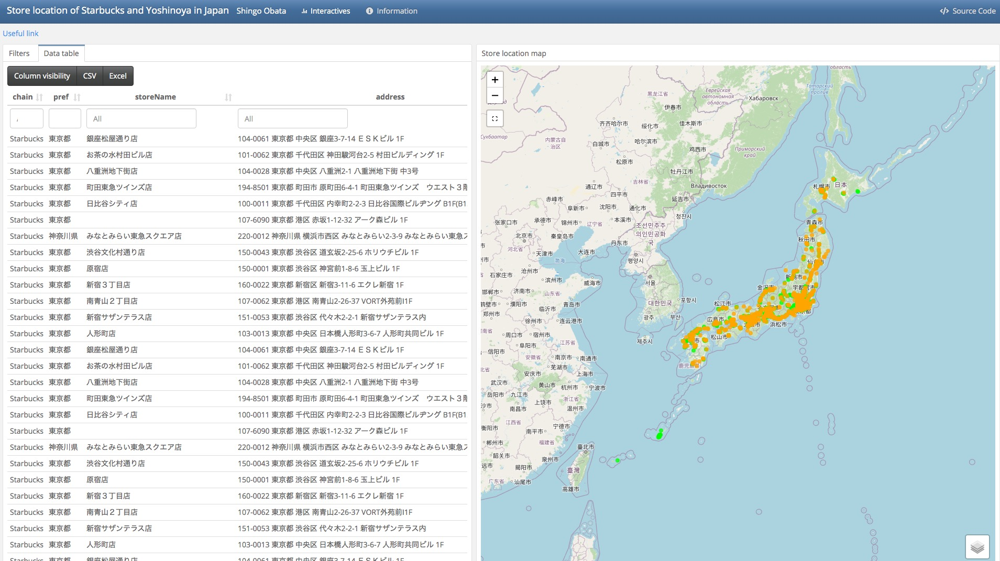

# [Interactive dashboard for the analysis of store location of Yoshinoya and Starbucks in Japan](https://shingobt.github.io/visualization/flexdashboard)

## About this project

This interactve web-app project was initially conducted as a class project in Programming for GIS ([GEOG 6590/6590L](http://bulletin.uga.edu/link.aspx?cid=GEOG4590-4590L/6590-6590L)) taught at [Department of Geography, University of Georgia](https://geography.uga.edu/) in Fall 2018. Although the data collection was completed as of 2018, extensive works related to the development of the web-app was completed in winter 2020.

The main purpose of this project is to provide the dataset and tools to analyse the characteristics of two major restaurant chains in Japan. Through the data collection and spatial analysis of their preferences of the store location, I aimed at revealing their business strategy. Also, it is expected from this project that the users of this web-app can launch their own analysis of the chains. 

The first chain is [Yoshinoya](https://www.yoshinoya.com/en/), which is a Japanese multinational aliment chain, and therefore the second-largest chain of gyūdon (beef bowl) restaurants. The chain was established in Japan in 1899. The number of its store is 1195 as of winter 2020. Another chain is Starbucks Coffee Japan. 

[Starbucks Coffee Japan](https://www.starbucks.co.jp/en/index.html) was established in October 1995, Since the opening of its first store on August 2, 1996, in the Ginza district of Tokyo, the chain has expanded rapidly throughout the country and has reached 1530 stores as of the end of December 2019.

## How to use
This web-app is comprised of two different pages, *Interactives* and *Information*. *Interactives* page provides the interactive store location data with filters, data table, and map. The *Information* page describes about this project, instruction of the usage of this web-app, and development process.

### Filters

You can:

* select either or both Starbucks or Yoshinoya using the left checkboxes.
* select one or more prefecture using the right checkboxes (the prefecture name is in Japanese).

### Interactive map

You can:

* click to grab and drag the map around
* zoom with the '+' and '--' buttons (top-left) or with your mouse's scroll wheel
* click a circle to open a popup with information about the store. 
* click the button showing a broken square (top-left under the zoom options) to pick out points on the map employing a window that's draggable (click and hold the grid icon within the upper left) and resizeable (click and drag the white boxes in each corner)
* click the layered squares button (bottom-right of the map) to select the raster data displayed on the map. The rasters you can select are
    * OpenStreetMap
    * Satellite imagery
    * kernel density estimation raster for Yoshinoya
    * kernel density estimation raster for Starbucks    

### Interactive table

You can:

* Filter each column by sort in boxes under the header of each column.
* Order the columns by clicking on the column header (ascending and descending).
* Adjust the columns are visible by clicking the Visibility button for columns.
* Click the 'CSV' or 'Excel' button to save the filtered data to the.csv or.xlsx file
* See how many entries are left in the bottom-left after screening, where it states 'Showing X to Y Z entries'

## Development

### Data collection

The store location is collected from the websites of [Yoshinoya](https://www.yoshinoya.com/en/) and [Starbucks Japan](https://www.starbucks.co.jp/en/index.html).

I used [Python 3.5.1](https://www.python.org/downloads/release/python-351/) operating under [Anaconda Distribution](https://www.anaconda.com/distribution/) to scrape store information from two websites. The modules employed for the task are:

* [selenium](https://pypi.org/project/selenium/) for web-scraping.
* [pandas](https://pandas.pydata.org/) to manage and structure the scraped data.
* [googlemaps](https://github.com/googlemaps/google-maps-services-python) to use [Geocoding API](https://developers.google.com/maps/documentation/geocoding/start) provided by Google.

As a result of the scraping with Python, All the store name,store address, and store coordinates (defined by latitude and longitude) are obtained in the python code.

### Interactive web-app

To create interactive web-app, [R v3.5.1](https://www.r-project.org/) and [Rstudio v 1.1.423](https://rstudio.com/) are used. R Markdown based [flexdashboard](https://rmarkdown.rstudio.com/flexdashboard/) is the key feature for this ap. The R packages employed for the creation of this web-app are:

* flexdashboard
* [leaflet](https://rstudio.github.io/leaflet/) to achieve interactive mapping of the rasters and points. 
* [DT](https://rstudio.github.io/DT/) to create interactive table.
* [crosstalk](https://rstudio.github.io/crosstalk/) for inter-widget (between filters, table, and map) interaction.
* [rgdal](https://cran.r-project.org/package=rgdal), [raster](https://cran.r-project.org/package=raster/raster.pdf), and [sp](https://cran.r-project.org/package=sp/sp.pdf) to handle the spatial dataset. 

### Resources

This web-app is located at [my portfolio site](https://shingobt.github.io/visualization/flexdashboard) (the portfolio site itself is under construction). 

### Future works

Remained tasks for this project are:

* scraping more information from the websites such as parking lot availability and business hour.
* adding more franchises as the object of comparison.
* performing more advanced geospatial analysis.
